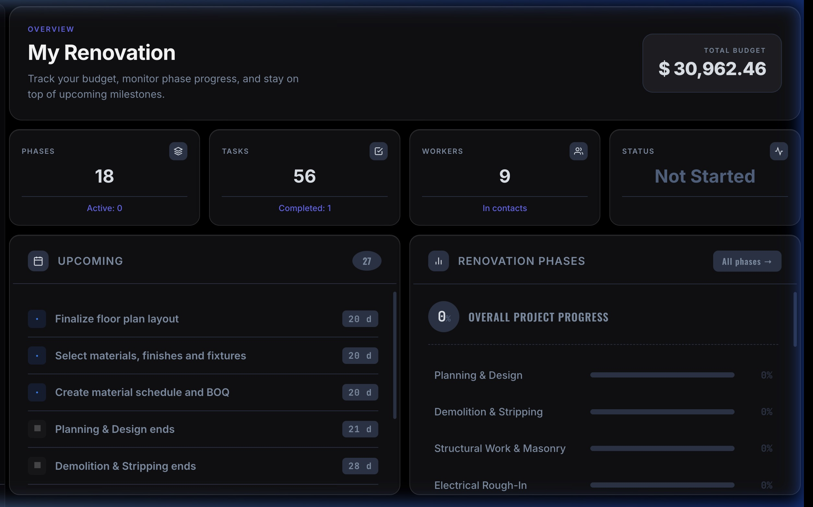
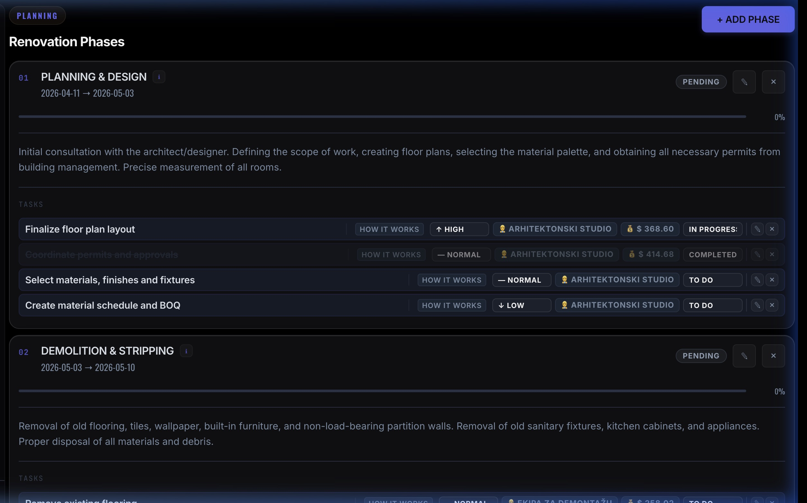
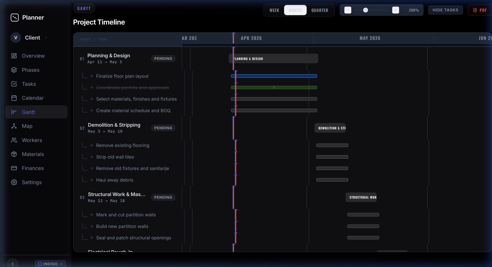
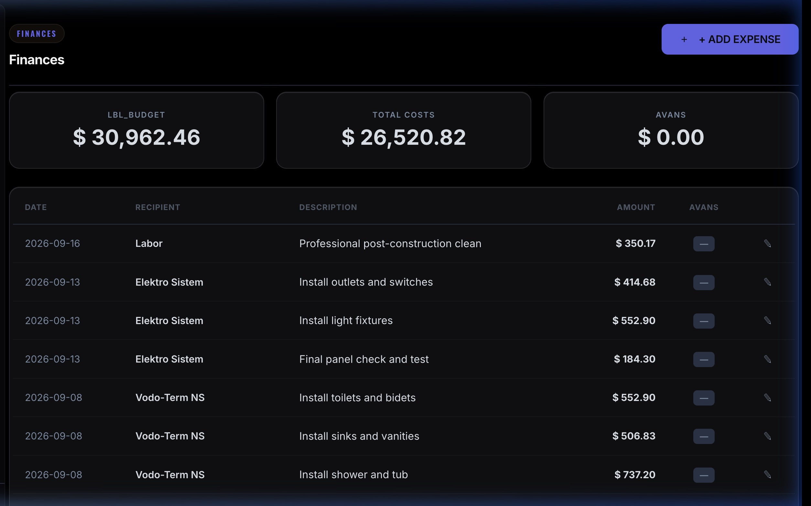
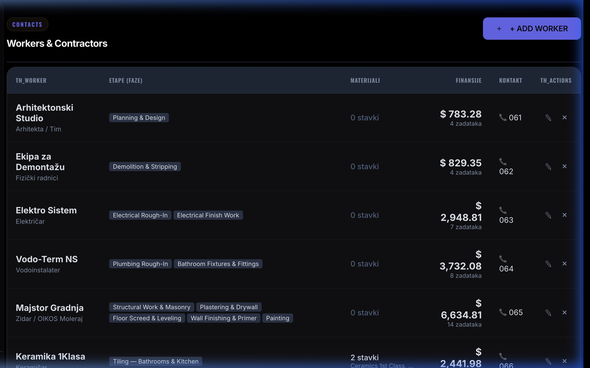
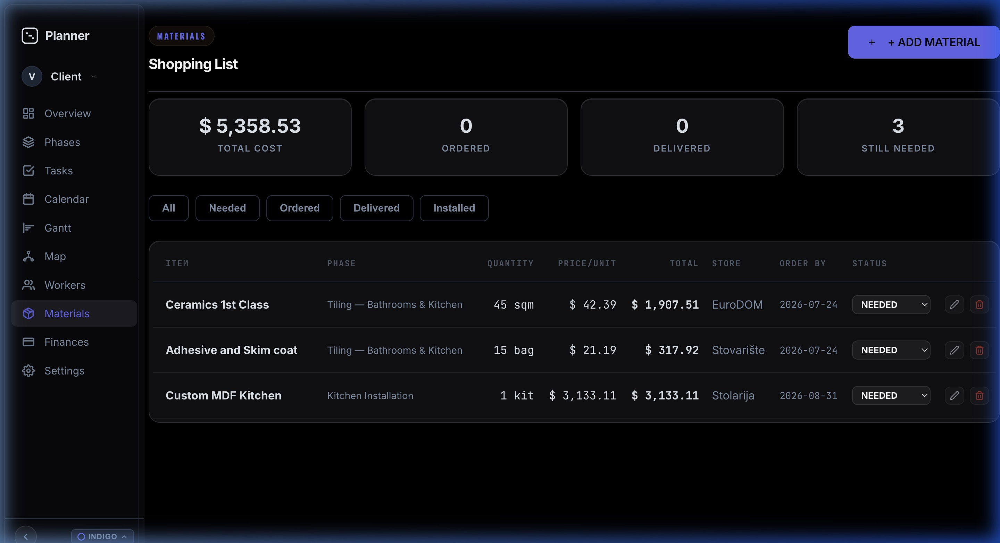
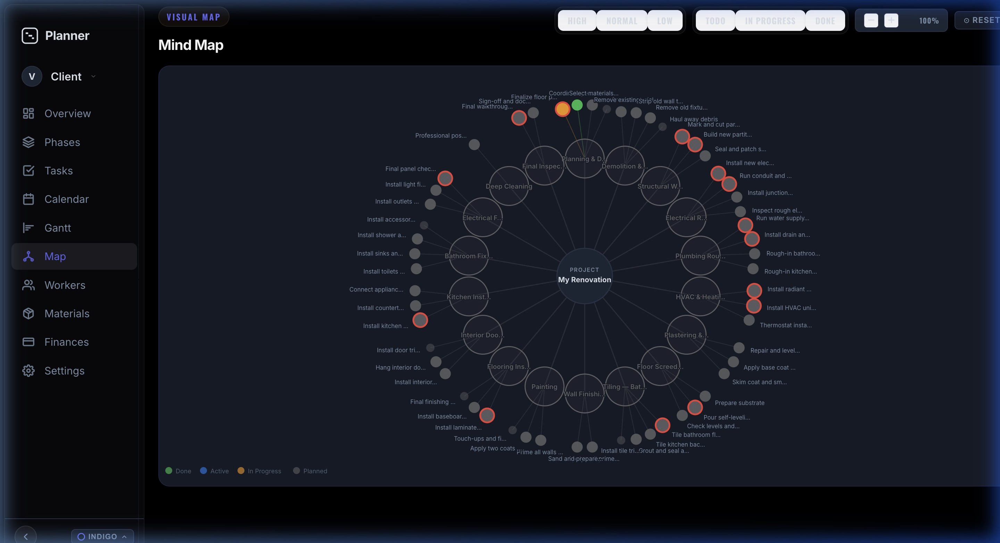
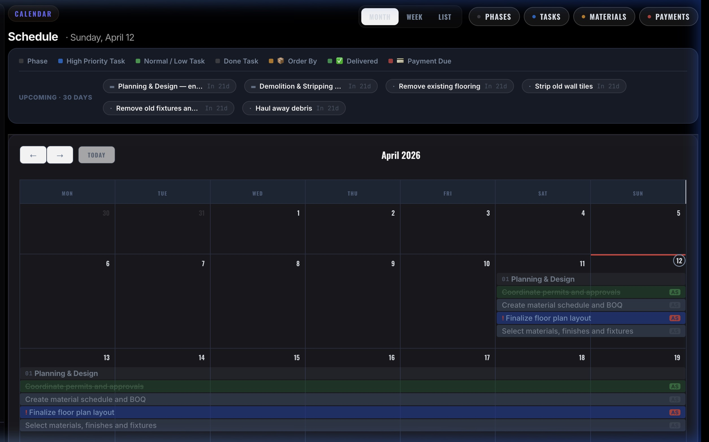

<p align="center">
  
</p>

<h1 align="center">RenovationSteps</h1>

<p align="center">
  <strong>Free, self-hosted construction project management tool.</strong><br>
  Track phases, tasks, workers, materials, expenses, payments, and site logs — all in one place.
</p>

<p align="center">
  <a href="https://renovationsteps.com">renovationsteps.com</a> &nbsp;·&nbsp;
  <a href="https://renovationsteps.com/pricing.html">Get Templates</a>
</p>

> Built for small contractors, solo builders, and renovation investors who need structure without a monthly subscription.

---

## Screenshots

| Dashboard | Phases & Tasks |
|-----------|---------------|
|  |  |

| Gantt Chart | Finances |
|-------------|----------|
|  |  |

| Workers | Materials |
|---------|-----------|
|  |  |

| Mind Map | Calendar |
|----------|----------|
|  |  |

---

## Features

- **Project management** — phases, tasks, priorities, deadlines, progress tracking
- **Worker management** — assign tasks, track rates, manage payments
- **Financial tracking** — budget, expenses, advance payments, change orders
- **Materials list** — quantities, prices, delivery status per phase
- **Gantt chart** — visual timeline per phase and task
- **Mind map view** — project overview as a visual graph
- **Calendar** — task deadlines at a glance
- **Search** — instant search across tasks, phases, workers, and materials
- **Themes** — 2 dark + 2 light built-in themes (Indigo Dark, Classic Dark, Indigo Light, Classic Light)
- **Share token** — share read-only project view with clients
- **Multi-language** — task titles in SR / RU / ZH
- **Export** — project data export

---

## Tech Stack

- **Backend** — Node.js, Express
- **Database** — SQLite via Prisma ORM (no database server needed)
- **Frontend** — Vanilla JS, Tailwind CSS
- **Auth** — bcryptjs, session tokens

---

## Getting Started

### Prerequisites

- Node.js 18+

### 1. Clone and install

```bash
git clone https://github.com/vladimirperovic/RenovationSteps.git
cd RenovationSteps
npm install
```

### 2. Set up environment

```bash
cp .env.example .env
```

`.env.example` includes working default credentials — no configuration needed to get started:

| Role  | Username | Password   | Access |
|-------|----------|------------|--------|
| Admin | `admin`  | `admin123` | Full access — all projects, admin stats panel, can manage everything |
| User  | `user`   | `123456`   | Own project only — create and manage their own renovation project |

Additional users can self-register via the Sign Up form — each gets their own isolated project.

> Change these before exposing the app publicly. To generate a new password hash:
> ```bash
> node -e "const b=require('bcryptjs'); console.log(b.hashSync('yourpassword',10));"
> ```

### 3. Set up database

```bash
npx prisma migrate deploy
npx prisma generate
node prisma/seed_cli.js
```

SQLite creates a local `dev.db` file automatically — no database server needed.

### 4. Run

```bash
npm start
```

Open `http://localhost:3000` and log in with `admin` / `admin123`.

For development with auto-reload:

```bash
npm run dev
```

---

## Deployment

Designed to deploy on any Node.js host. Tested on **Coolify** (self-hosted).

Set the environment variables from `.env.example` in your hosting panel. On startup, `npm start` automatically runs migrations and seeds the database.

---

## Email verification (optional)

By default, self-registered accounts are activated immediately — no email needed.

To enable email verification, add a [Resend](https://resend.com) API key to `.env`:

```env
RESEND_API_KEY=re_your_key_here
CONTACT_TARGET_EMAIL=you@example.com
```

---

## Paid Templates

The free version gives you a fully working planner — you set up your own phases, tasks, workers, and budgets from scratch.

**Premium templates** come pre-filled with realistic phases, tasks, workers, lead times, and price estimates for specific project types:

- Studio apartment renovation
- 2-room apartment renovation
- 3-room apartment renovation
- *(more being added)*

**€20 per template** — one-time purchase, import in one click.

> [renovationsteps.com/pricing.html](https://renovationsteps.com/pricing.html)

---

## License

MIT — free to use, modify, and self-host.  
Templates are not included in this repository and are sold separately.
